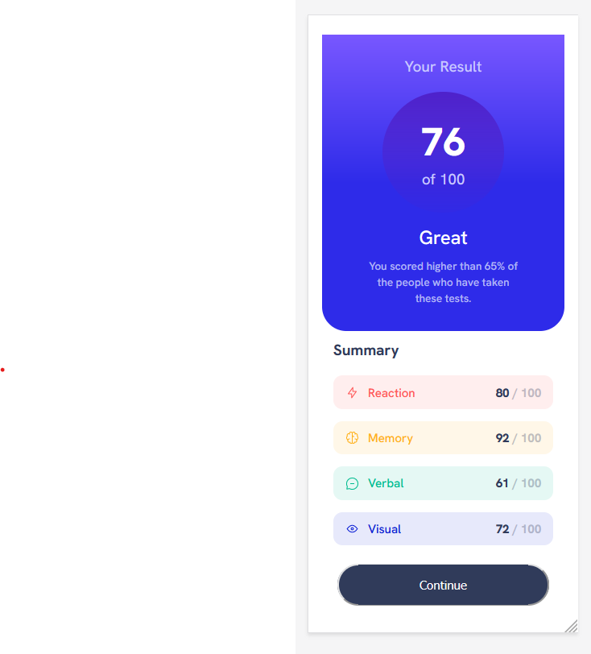

# Frontend Mentor - Results summary component solution

This is a solution to the [Results summary component challenge on Frontend Mentor](https://www.frontendmentor.io/challenges/results-summary-component-CE_K6s0maV). Frontend Mentor challenges help you improve your coding skills by building realistic projects. 

## Table of contents

- [Overview](#overview)
  - [The challenge](#the-challenge)
  - [Screenshot](#screenshot)
  - [Links](#links)
- [My process](#my-process)
  - [Built with](#built-with)
  - [What I learned](#what-i-learned)
  - [Continued development](#continued-development)
  - [Useful resources](#useful-resources)
- [Author](#author)
- [Acknowledgments](#acknowledgments)

## Overview
### The challenge

Users should be able to:

- View the optimal layout for the interface depending on their device's screen size
- See hover and focus states for all interactive elements on the page

### Screenshot

### 
Desktop view
 

### 
Mobile View
 

# 
### Links

- Solution URL : [Git URL](https://github.com/mathangisd/results-summary-component-main.git)

- Live URL : [Results Summary Component on Netlify](https://results-summary-msd.netlify.app/)

## My process
### Built with

- Semantic HTML5 markup
- CSS custom properties
- CSS Grid
- CSS Flexbox
- Media Query
- Hover and Focus state for button

### What I learned

I was able to practice media query, flexbox and grid properties. I also learned how to form a circle and place it inside a div and was able to practice linear gradient.

### Continued-Development
I would like to keep working on other projects that involve different responsive layouts.

### Useful resources

- [Typescale](https://typescale.com/)

## Author
- Website - [Mathangi Subramanian](https://github.com/mathangisd)
- Frontend Mentor - [mathangisd](https://www.frontendmentor.io/profile/mathangisd)

## Acknowledgments
Thank you to anyone for giving any feedback, it is always helpful to know how the code could be improved.